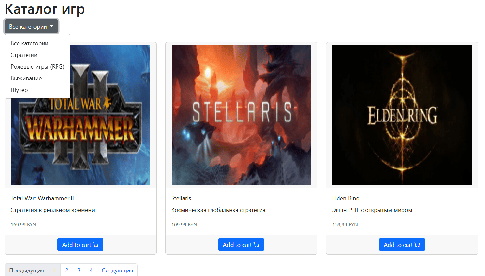
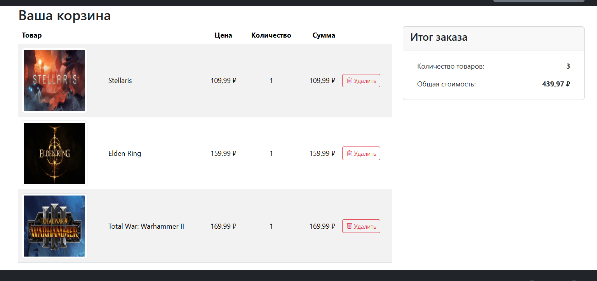
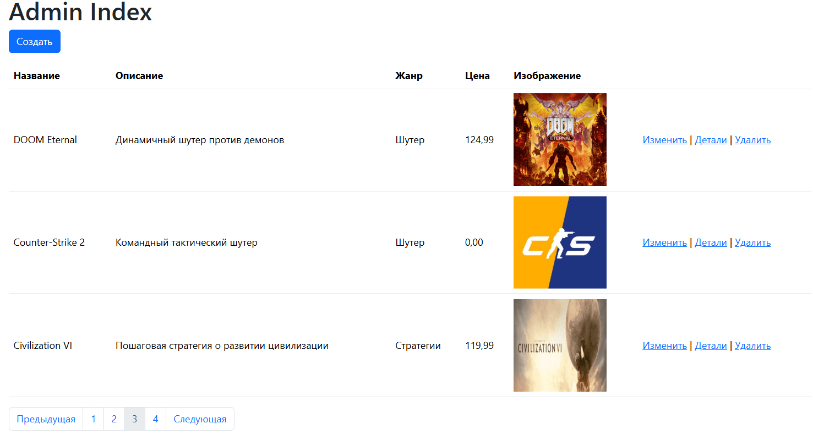

# Каталог компьютерных игр

Веб-приложение для управления каталогом компьютерных игр

*Каталог игр с фильтрацией по жанрам и пагинацией*

*Корзина с товарами и итоговой суммой*

*Панель администрирования с CRUD операциями*

 

*Профиль пользователя с меню выхода*

### Архитектура (не учитвая Blazor)

- **WEB_353501_Gruganov.Domain** - доменная модель и бизнес-сущности
- **WEB_353501_Gruganov.API** - RESTful API 
- **WEB_353501_Gruganov.UI** - веб-интерфейс на ASP.NET Core MVC и Razor Pages
- **WEB_353501_Gruganov.Tests** - модульные тесты

### Backend

- **ASP.NET Core 9.0** - основной фреймворк для веб-приложения
- **Entity Framework Core 9.0** - ORM для работы с базой данных
- **PostgreSQL** - реляционная база данных
- **MediatR** - реализация паттерна CQRS (Command Query Responsibility Segregation)
- **Keycloak** - аутентификация и авторизация через OpenID Connect (OIDC)
- **JWT Bearer** - аутентификация через токены для API
- **Serilog** - структурированное логирование запросов и событий

### Frontend
- **ASP.NET Core MVC** - серверный рендеринг с Razor Views
- **Razor Pages** - для административной панели

## Основной функционал

### Для пользователей
- Просмотр каталога игр с фильтрацией по жанрам
- Поиск и просмотр детальной информации об играх
- Добавление товаров в корзину
- Управление корзиной покупок (добавление/удаление товаров)
- Аутентификация через Keycloak

### Для администраторов
- CRUD операции для управления играми
- Загрузка и управление изображениями игр
- Управление жанрами
- Пагинация и фильтрация в админ-панели

## База данных

Проект использует **Entity Framework Core** как основной ORM для работы с базой данных **PostgreSQL**:

- **DbContext** (`AppDbContext`) - централизованный контекст для работы с БД, содержащий `DbSet<Game>` и `DbSet<Genre>`
- **Сущности**:
  - `Game` - основная сущность каталога (название, описание, цена, изображение)
  - `Genre` - жанры игр
  - `CartItem` - элементы корзины покупок
- **Связи**
  - Связь один-ко-многим: `Game` &rarr; `Genre` (один жанр может включать много игр, но одна
    игра принадлежит одному жанру)
- **Загрузка связанных данных** - использование `Include()` для загрузки связанных сущностей (например, `Genre` при загрузке `Game`)
- **Асинхронные операции** - все операции с БД выполняются асинхронно (`ToListAsync()`, `CountAsync()`, `SaveChangesAsync()`, `AddRangeAsync()`)
- **LINQ запросы** - построение сложных запросов с фильтрацией, сортировкой и пагинацией через LINQ
- **Инициализация данных** - заполнение БД начальными данными через `DbInitializer.SeedData()` при первом запуске приложения
  
---

### CQRS (Command Query Responsibility Segregation)
Разделение операций чтения и записи через библиотеку **MediatR**:
- **Commands** (CreateGame, UpdateGame, DeleteGame) - для изменения данных
- **Queries** (GetListOfGames, GetGameById) - для получения данных

### Dependency Injection
Полное использование встроенного DI-контейнера ASP.NET Core для управления зависимостями.

### Middleware Pipeline
Кастомный middleware для логирования HTTP-запросов (`RequestLoggingMiddleware`).

